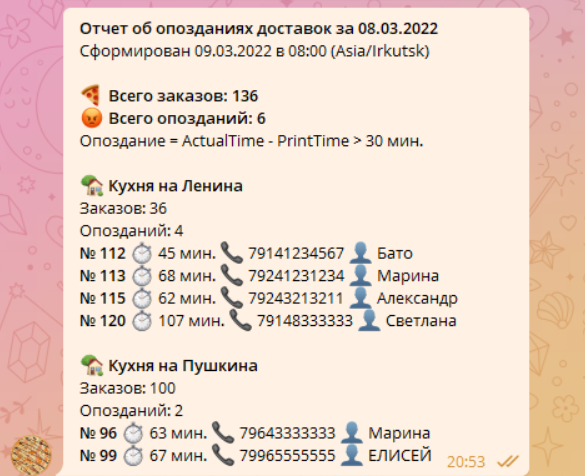

# iiko-telegram
Скрипт, который парсит заказы, обрабатывает, рассылает СМС пользователям и отправляет лог в телеграм от имени телеграм бота. В данном примере скрипт считает время заказа и клиентам, которым заказ доставили с опозданием рассылает промокод.

## Константы
Достаточно их изменить  и скрипт начнет работать. В примере учетные данные демонстрационных аккаунтов айко.
Демоаккаунты можно найти [тут](https://examples.iiko.ru/server/?example=olap) и [тут](https://examples.iiko.ru/delivery/?example=get_courier_orders)

- LATENESS_THRESHOLD_IN_MINUTES = 30
- REPORT_TIMEZONE = 'Asia/Irkutsk'
- DEBUG = True     # without adding a category for client and sending SMS
- ACCESS_TOKEN = str()
- IP = 'https://iiko.biz'
- PORT = '9900'
- CHAT_ID = 99999999  # channel_id
- BOT_TOKEN = 'bot_token_here'
- ORGANIZATION_ID = 'organization_id'
- IIKO_LOGIN = 'admin'
- IIKO_PASSWORD = 'a94a8fe5ccb19ba61c4c0873d391e987982fbbd3'
- IIKO_BIZ_LOGIN = 'demoDelivery'
- IIKO_BIZ_PASSWORD = 'Pl1yFaKFCGvvJKi'
- RESTAURANT = 'PIZZA_IS_YAMMY'
- KITCHEN1 = 'first_kitchen_id'
- KITCHEN2 = 'second_kitchen_id'
- ...

## Последовательность вызовов iiko API:
1. Авторизация в iiko Server API — /resto/api/auth.
2. Выгрузка OLAP отчета — /resto/api/v2/reports/olap.
3. Освобождение лицензии Server API — /resto/api/logout.
4. Авторизация в iiko Delivery API — /api/0/auth/access_token.
5. Поиск клиента по номеру телефона — /api/0/customers/get_customer_by_phone.
6. Добавить клиенту подарочную категорию — /api/0/customers/customerId/add_category.
7. Отправить клиенту SMS сообщение — /api/0/organization/id/send_sms.

## Документация
-   iikoBiz API:  [https://docs.google.com/document/d/1pRQNIn46GH1LVqzBUY5TdIIUuSCOl-A_xeCBbogd2bE](https://docs.google.com/document/d/1pRQNIn46GH1LVqzBUY5TdIIUuSCOl-A_xeCBbogd2bE)
-   iikoCard API:  [https://docs.google.com/document/d/1kuhs94UV_0oUkI2CI3uOsNo_dydmh9Q0MFoDWmhzwxc](https://docs.google.com/document/d/1kuhs94UV_0oUkI2CI3uOsNo_dydmh9Q0MFoDWmhzwxc)
-   [https://examples.iiko.ru](https://examples.iiko.ru/)

