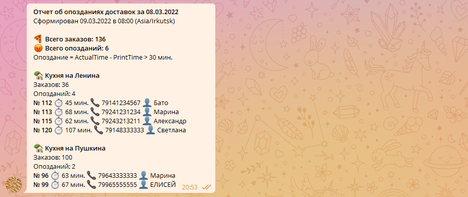

# iiko Telegram Bot

Python cкрипт, который выгружает из iiko заказы, обрабатывает, рассылает СМС пользователям и отправляет лог в Телеграм.

В данном примере скрипт считает время доставки заказа и рассылает промокоды тем клиентам, которым заказ доставили с опозданием.



## Константы

Перед запуском скрипта необходимо задать константам нужные значения. В данном примере указаны учетные данные демонстрационных аккаунтов Айко.

Демо аккаунты можно найти [тут](https://examples.iiko.ru/server/?example=olap) (iiko Server API) и [тут](https://examples.iiko.ru/delivery/?example=get_courier_orders) (iiko Delivery API или iikoBizApi).

```python
ACCESS_TOKEN = str()
DEBUG = True  # Without adding a category for the client and sending SMS
IIKO_BIZ_IP = 'https://iiko.biz'
IIKO_BIZ_LOGIN = 'demoDelivery'
IIKO_BIZ_PASSWORD = 'Pl1yFaKFCGvvJKi'
IIKO_BIZ_PORT = '9900'
IIKO_IT_NAME = 'SUSHI_PIZZA'
IIKO_SERVER_LOGIN = 'admin'
IIKO_SERVER_PASSWORD = 'a94a8fe5ccb19ba61c4c0873d391e987982fbbd3'
KITCHEN1 = 'first_kitchen_id'
KITCHEN2 = 'second_kitchen_id'
LATENESS_THRESHOLD_IN_MINUTES = 30
ORGANIZATION_ID = 'organization_id'
PROMO_CATEGORY_ID = 'c8726b30-742b-48a4-af8b-1f4d03a88b4d'
REPORT_TIMEZONE = 'Asia/Irkutsk'
TELEGRAM_BOT_TOKEN = 'bot_token_here'
TELEGRAM_CHAT_ID = 99999999
```

## Последовательность вызовов iiko API

1. Авторизация в iiko Server API — `/resto/api/auth`
2. Выгрузка OLAP отчета — `/resto/api/v2/reports/olap`
3. Освобождение лицензии Server API — `/resto/api/logout`
4. Авторизация в iiko Delivery API — `/api/0/auth/access_token`
5. Поиск клиента по номеру телефона — `/api/0/customers/get_customer_by_phone`
6. Добавить клиенту подарочную категорию — `/api/0/customers/customerId/add_category`
7. Отправить клиенту SMS сообщение — `/api/0/organization/id/send_sms`

## Документация

- Пост в блоге Семёна Фудова — [Telegram бот для iiko: анализ продаж и поиск опозданий доставок](https://blog.fudov.ru/telegram-bot-iiko-analiz-prodazh-i-poisk-opozdaniy)
- iikoBiz API: https://docs.google.com/document/d/1pRQNIn46GH1LVqzBUY5TdIIUuSCOl-A_xeCBbogd2bE
- iikoCard API: https://docs.google.com/document/d/1kuhs94UV_0oUkI2CI3uOsNo_dydmh9Q0MFoDWmhzwxc
- [https://examples.iiko.ru](https://examples.iiko.ru/)
